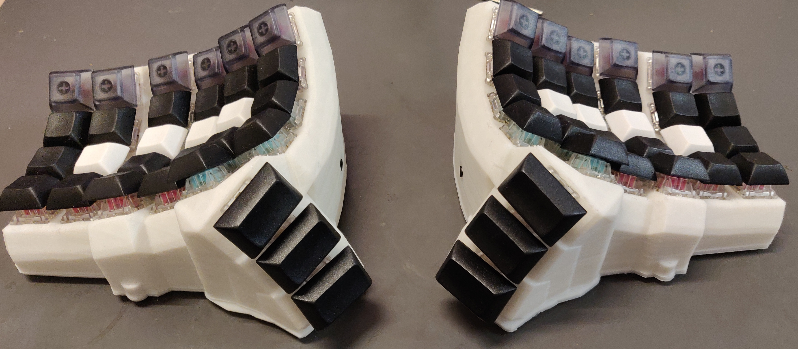
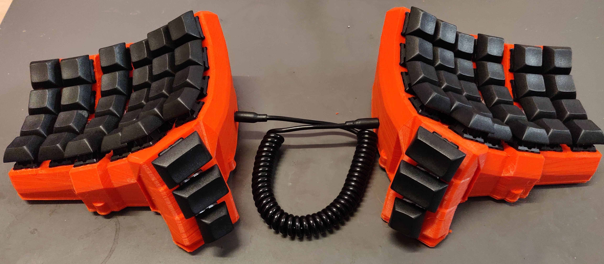

# The Dactyl-Simplethumb Keyboard
This is a fork of the [Dactyl Manuform](https://github.com/abstracthat/dactyl-manuform), which is a fork of [Dactyl](https://github.com/adereth/dactyl-keyboard), a parameterized, split-hand, concave, columnar, ergonomic keyboard.

Some changes include:
- Replaces the thumb cluster to something simple... get it? "Simplethumb"?
- Make things smaller
- The curvature is higher when the key is higher.
- Added some board holder that exposes the board port directly. 

## Assembly

### Generating a Design

**Setting up the Clojure environment**
* [Install the Clojure runtime](https://clojure.org)
* [Install the Leiningen project manager](http://leiningen.org/)
* [Install OpenSCAD](http://www.openscad.org/)

**Generating the design**
* Run `lein repl`
* Load the file `(load-file "src/dactyl_keyboard/dactyl.clj")`
* This will regenerate the `things/*.scad` files
* Use OpenSCAD to open a `.scad` file.
* Make changes to design, repeat `load-file`, OpenSCAD will watch for changes and rerender.
* When done, use OpenSCAD to export STL files

**Watch when developing**
* Run `lein watch`
* OpenSCAD automatically reload when the file change.

**Tips**
* [Some other ways to evaluate the clojure design file](http://stackoverflow.com/a/28213489)
* [Example designing with clojure](http://adereth.github.io/blog/2014/04/09/3d-printing-with-clojure/)

### Wiring

There are many way to wire it, refer to [Dactyl Manuform](https://github.com/abstracthat/dactyl-manuform) for more info. I used two Arduino Pro Micro, and now a Teensy 2.0++ and an mcp23017 on a prototype board.

## License

Copyright © 2015-2017 Matthew Adereth and Tom Short

The source code for generating the models (everything excluding the [things/](things/) and [resources/](resources/) directories is distributed under the [GNU AFFERO GENERAL PUBLIC LICENSE Version 3](LICENSE).  The generated models and PCB designs are distributed under the [Creative Commons Attribution-NonCommercial-ShareAlike License Version 3.0](LICENSE-models).

## Pictures

